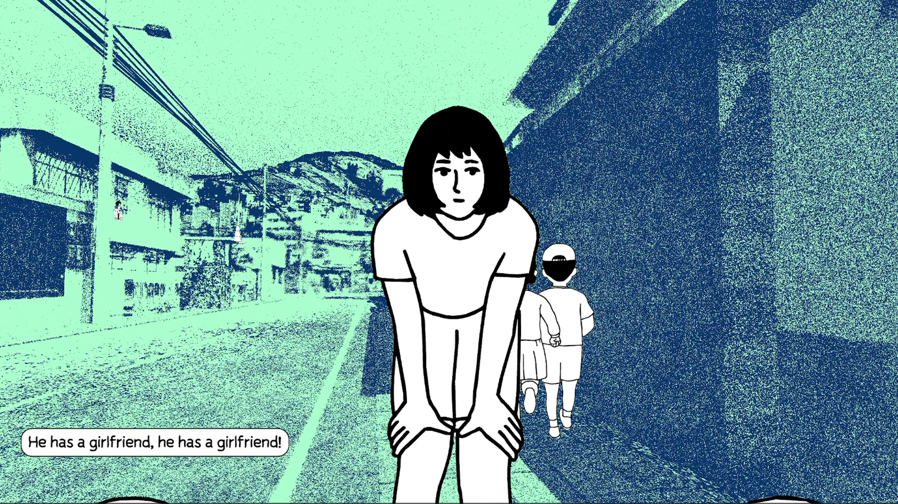
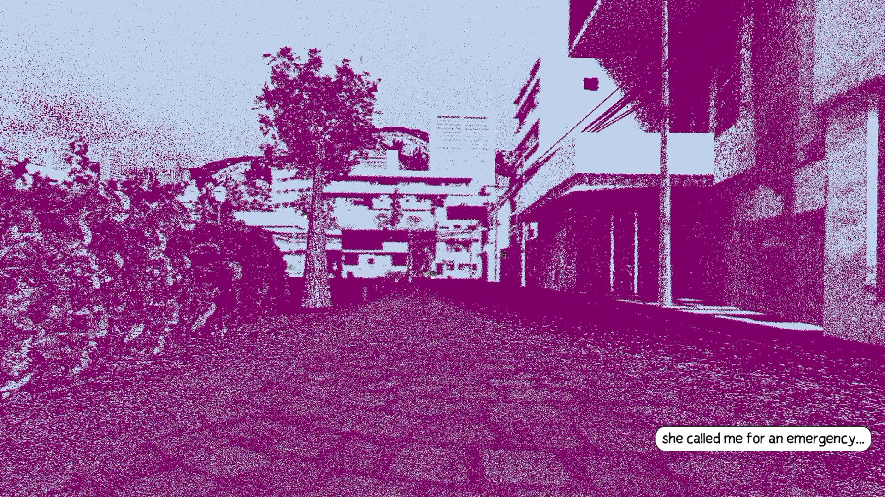
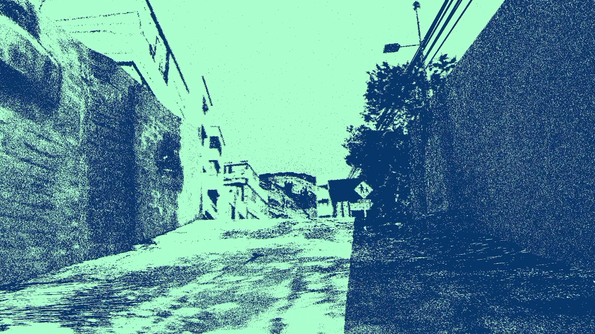
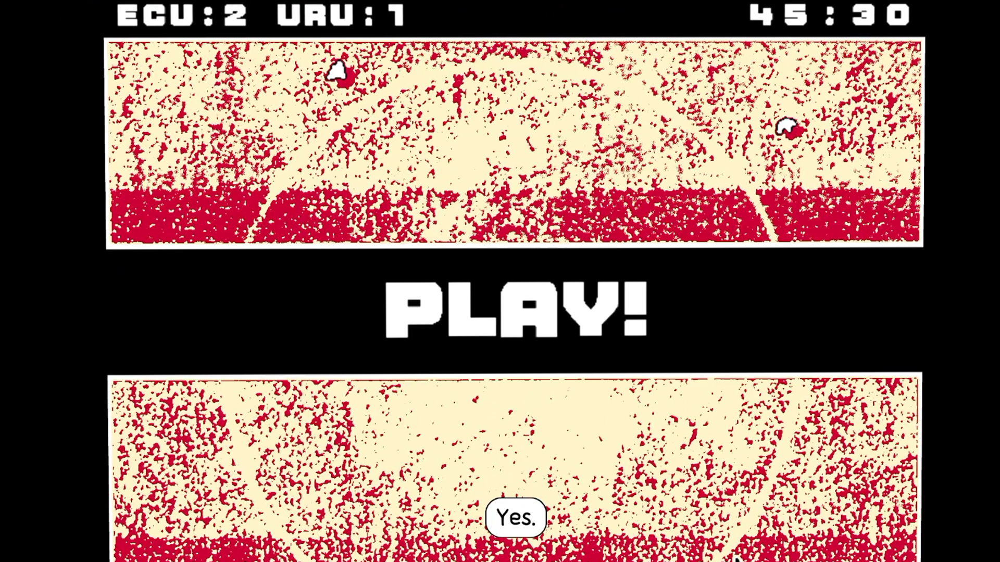
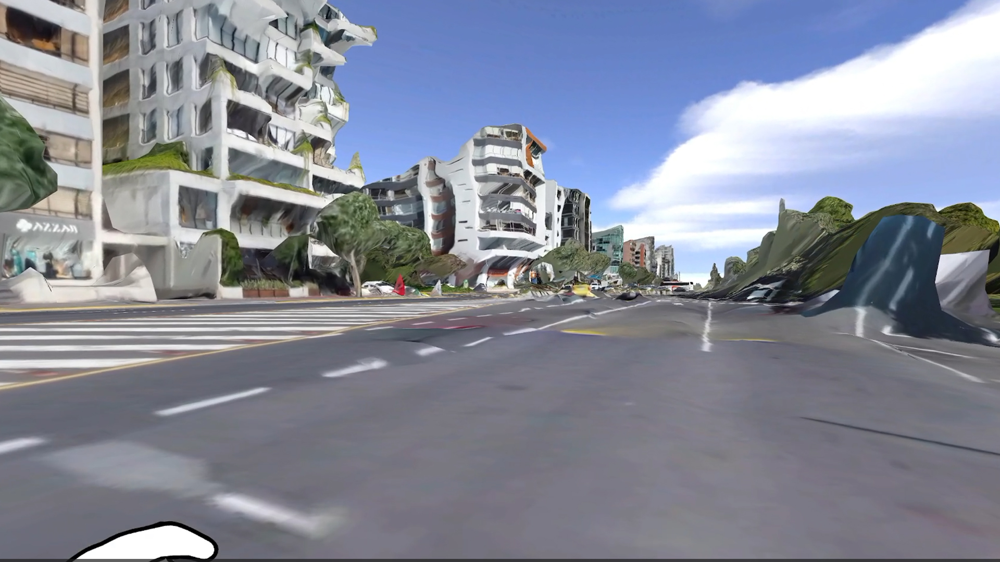
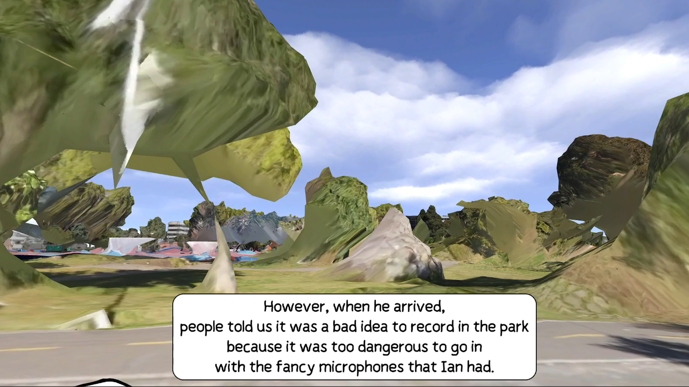
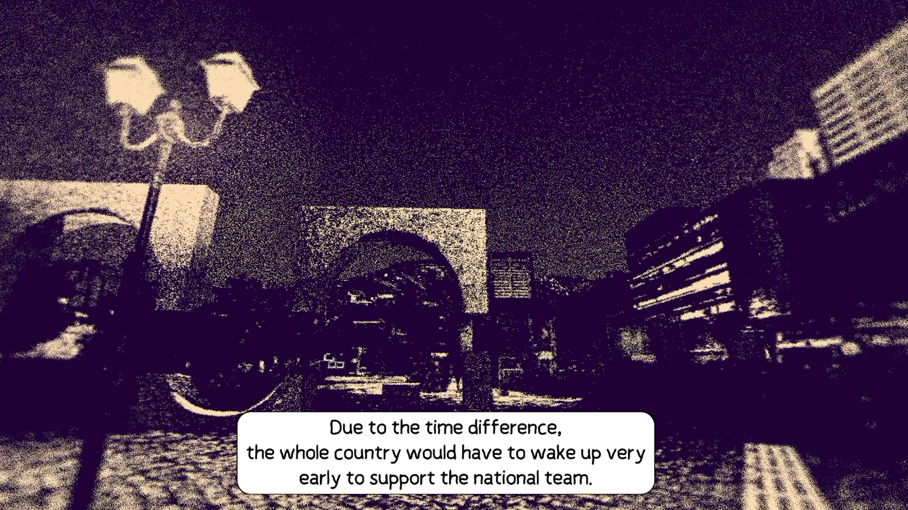

A single-session read of the second and last hour of game Despelote - short autobiographical adventure. Source: audio commentary.

recording:

https://youtu.be/L2N9TktN1lU

## Sequence

Childhood neighborhood, free-roam intro → "invisible wall-less" blocking by
environment → drawing pauses → car-window time jump to teenage years → house
party (free interaction) → arcade football interlude → 2D top-down wandering as
"the footballer" → landmark confusion in the neighborhood → photogrammetry square
(3D scan) → closing cutscene: becoming the ball.

## Observations

1. **A tiny mechanic set, doing all the narrative work.** The whole game runs on
   walking a 3D space, talking to people, and kicking a ball — level design (not
   mechanical depth) with strong narrative in dialogues is what carries culture, relationships, and how growing up
   in Quito actually felt. Called out explicitly as the design's major goal: transfer
   feeling with almost nothing in the verb list.

2. **Textures as photographs, interactible NPCs and object as outlined graphics.** The world's surfaces are
   near-photographic, noisy, drawn straight from real-world photo reference, laid over
   very simplified, almost billboard-flat geometry. The contrast is deliberate — meant
   to feel like walking around inside old photographs, and it doubles as a soft
   navigation cue (what's "real" enough to matter reads differently from what isn't).

3. **Soft blocking instead of walls.** Levels open with near-total freedom to explore;
   invisible walls are rare. Blocking is done almost entirely through environmental
   design — buildings, terrain, and layout physically closing routes rather than
   artificial barriers. First-instinct read: this alone is the "honest architecture"
   move (**PP-13**) — the world looks unrestricted because the restriction is baked
   into the space itself.

4. **A time limit that doesn't actually limit you.** The only real constraint most
   chapters offer is diegetic: the mother tells the boy to be back in two hours. Being
   late or on time doesn't appear to matter mechanically — but the *knowledge* of the
   clock, while still being free to roam, is explicitly compared to the real childhood
   feeling of wanting to explore while knowing you're expected home. Constraint as
   mood, not as failstate.
5. **Real-world scale, sold by the camera.** The neighborhood's dimensions track real
   street proportions rather than a game-convenient layout, and camera work leans into
   that scale to sell smallness — the world isn't shrunk to the player, the player
   (and camera) is shrunk to the world.
6. **Color as a timeline.** Distinct palettes mark distinct time periods — red
   dominates the teenage/football/party years — giving the player a cheap, constant
   orientation cue for *when* a given memory is taking place, on top of the "where."
7. **Environmental prompts move you through time, optionally.** Time-jumps are tied to
   small environmental triggers rather than menus or hard cuts (few times) — looking out a car
   window during a family drive, for instance, slides the game from a younger boy to
   the teenage timeline. The prompt can be ignored; nothing forces engagement with it.
8. **Drawing as a pacing brake.** A small drawing interaction (paper, later a fogged
   car window) exists mainly to root the player in one spot and slow the rhythm down —
   a deliberate stall built as an interaction rather than a cutscene, so the slowdown
   still feels like play.
9. **The arcade football minigame — a deliberate downgrade.** Play periodically drops
   from 3D exploration into a bare top-down/side arcade football minigame. Flagged as
   "clunky" and not narratively load-bearing on its own — its job is to simulate
   tuning out the real world the way a kid does when locked onto a game, while people
   and events keep happening, unattended to, around them.

10. **Walking as "the footballer," without a match.** Later, that same football
    identity is repurposed: a top-down sequence has you walking the neighborhood *as*
    the footballer character, with no goal to score and no match to play — just
    traversal wearing a different mechanical skin, and, per the commentary, harder to
    orient in than the standard first-person walk.
11. **Landmarks that don't quite work.** A handful of intended orientation
    monuments exist (a playground, the stadium), but many environmental elements read
    as too similar to each other, and the commentary reports genuinely never learning
    to navigate the neighborhood by landmark — always just walking until arrival,
    never sure left from right. Possibly intentional (it mirrors a kid's actual
    disorientation in their own neighborhood) but flagged as a real point of friction
    either way.
12. **The photogrammetry square — fiction breaks into document.** Late in the game, a
    familiar recurring square — seen stylized, at different times of day, across the
    whole run — suddenly appears as an unfiltered real-world 3D scan, the kind
    associated with Google Maps-style capture. Framed by the director's own voiceover
    explaining the choice. The jump from stylized environment to raw photogrammetry
    is used specifically to sell the game's documentary/autobiographical register, not
    just as a visual trick — a chance to compare the world you've gotten used to
    against how the real place actually measures up.

13. **Losing all control, becoming the ball.** In the closing sequence, a kicked ball
    becomes the literal camera/player object: no control is given back, the player is
    passively carried through the environment and past most of the characters met
    over the course of the game — a full inversion of the earlier free-roam,
    CCTV-like traversal, used purely as a cinematic wrap-up.

**▸ Full walkthrough from the recording (structured transcript)**

Jachym's commentary from the session recording, cleaned & structured — detail layer for
the observations above.

**Overview (obs. 1–2).** Despelote is introduced as a single-player, first-person
adventure, artistically distinguished by its visuals and theme, slow-paced, and
balancing fictional and autobiographical storytelling — an attempt to transfer how it
felt for Julián, the game's author, growing up in Quito, Ecuador around the turn of
the 20th/21st century, filled with football references as the connective thread of the
period. Level design is called on to teach history, culture, and relationships largely
through traversal, since the mechanic set is deliberately tiny: kicking a ball, talking
to people, moving through 3D space, listening. Sound is highlighted as central to both
orientation and feeling. The visuals are unique: noisy, near-photographic real-world
textures laid over very simplistic, outline-and-billboard geometry, meant to move the
player through an "environment of feelings," almost like walking within photographs.

**Free exploration and soft blocking (obs. 3–4).** Chapters typically open with freedom
to discover everything; invisible walls are rare, and blocking mostly comes from
environmental design rather than hard barriers. The one real limit is usually diegetic —
the mother telling the boy they need to meet up again in two hours, a deadline that
doesn't appear to be strictly enforced. The feeling of it — free to roam while knowing
you're expected somewhere — is explicitly likened to actual childhood.

**Scale and orientation (obs. 5–6).** The neighborhood where Julián grows up may or may
not map onto a real place exactly, but its dimensions follow real street scale, and that
scale, combined with camera work, is what sells feeling small as a child, more than any
UI or mechanic does. A handful of level variants punctuate this — a party level, for
instance, where the player is again simply free to interact with people. Color plays an
orientation role across time periods too — red dominates the sections where the
protagonist is older, playing football and going to parties, helping mark which
timeline you're currently in.

**Time-jumps and drawing pauses (obs. 7–8).** A blurry, dreamlike sequence (visually
distinct from the more "realistic"-attempting present) ends with the mother picking the
boy up. Interior scenes follow, with a beloved beat of scale — small household objects
reading as slightly larger than the child. A small drawing mechanic — on paper, later on
a fogged-up car window — exists to slow the pace deliberately, locking the player in one
spot; it's frequently used to carry a time transition, such as looking out the window
during a drive with parents, shifting from the younger boy to a teenage timeline. The
prompt is optional — nothing forces you to draw before moving on.

**Arcade football + top-down wandering (obs. 9–10).** A recurring mechanic switches
from 3D exploration into a 2D arcade football minigame — described as clunky and not
plot-progressing on its own, its role instead being to simulate the feeling of being
absorbed in a game while people talk and events happen, unattended to, around you (a
street scene with a match playing on a TV and a crowd talking is called out
specifically). Later, the same football identity resurfaces as a top-down walking
mode — no goal of scoring or playing a match, just wandering the neighborhood as "the
footballer," which the commentary found genuinely disorienting at first.

**Landmark trouble (obs. 11).** A dedicated aside: there are a few distinguishable
landmarks meant for orientation — a playground, the football stadium among them — but
never enough practice or distinction to actually learn the neighborhood's layout by
them. The habit that formed was simply walking toward the destination without ever
being sure of direction — confusion that was worse in a later 2D-only section.

**The photogrammetry square (obs. 12).** In the game's last section, an important match
is being played in a familiar, much-revisited square — seen before at different times of
day, in different colors, across different periods. Kicking the ball here transfers the
player into a raw, unfiltered real-world 3D scan of that same square, of the kind
associated with Google Maps-style capture — walking inside it feels surreal and playful,
like walking through a miniature or a toy, something tangible and relatable. A voiceover
from the game's creator explains wanting to include this literal scan of the real place.
Framed as an amazing contrast to the game's visual stylization, and, from a level-design
angle, as a chance to directly compare the fictionalized version of the square you've
gotten used to against its real scale — supporting the game's position on the edge of
documentary and autobiography, trying to carry not just feelings but facts about how life
in Ecuador actually looked at the time.

**Becoming the ball (obs. 13).** The closing sequence: now older, playing with friends
before a party, one last camera/perspective shift turns the player into the football
itself while listening to party stories — kicked and flown around the familiar
environment with zero control, purely observational, like a cutscene. Where the earlier
free-roam felt like operating a "CCTV camera" over the neighborhood, this inverts it
completely: now you *are* the ball, passing most of the characters met over the course of
the game, used as a cinematic wrap-up.

### New threads from the recording

- **Constraint as mood, not failstate.** The two-hour deadline is stated but not
  policed — a rare example of a ticking clock used purely for emotional pressure while
  leaving mechanical freedom fully intact.
- **Mechanical identity swap without a new verb.** The football minigame and the later
  top-down "walking as the footballer" mode reuse the same core traversal verb in a
  different frame/scale, rather than adding new mechanics — a light way to reskin
  familiar movement into a different feeling (absorption vs. disorientation).
- **Photogrammetry as a genre statement.** Dropping an unfiltered real-world 3D scan
  into an otherwise fully stylized world is a blunt, one-time tool for asserting the
  game's documentary/autobiographical register — worth comparing against Indika's
  much more theme-driven scale shifts (giant fish, giant bells): here the "shift" is a
  shift in *representational honesty*, not object size.
- **Losing control as an ending device.** The final "become the ball" sequence removes
  agency entirely to close the game — comparable in function, if not in tone, to
  Indika's flashback/cutscene handoffs, but pushed to zero interactivity rather than a
  reduced one.
- **Landmark failure, possibly on purpose.** Unlike Indika's strong light/audio
  guidance throughout, Despelote's navigation is called out as a genuine weak point —
  raising the open question of whether disorientation is an intentional echo of
  childhood confusion or simply underbaked landmark design. Worth flagging as an
  open question rather than resolving it either way.

## Conclusion

<todo — Jachym: the throughline here is minimal-mechanics-as-vessel — kick, walk, talk,
draw, and everything else is level design and art doing the storytelling. The
photogrammetry-square beat feels like the strongest single idea in the game and worth
its own short writeup, maybe cross-referenced against Indika's scale-shift thread even
though the effect used is basically opposite (raw documentary vs. surreal stylization).
Also want to go back and specifically map where navigation broke down — was it always
the top-down football sections, or did it happen in first-person too?>
