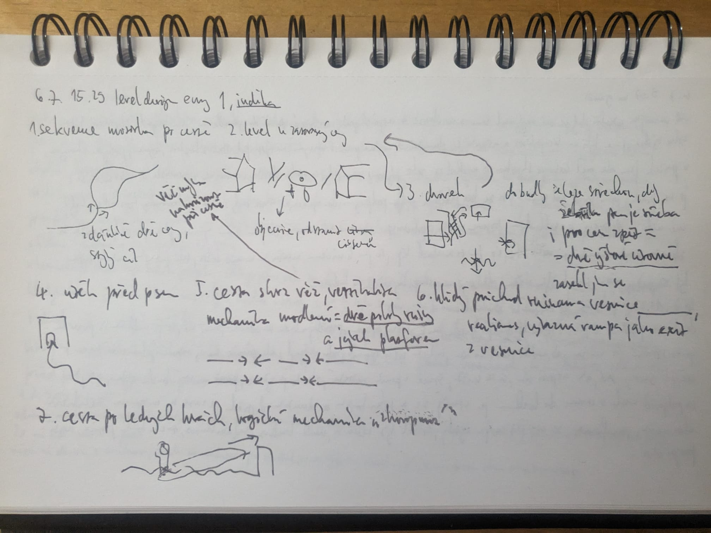

Session log 6.7. 15:29 — handwritten notes, transcribed & translated from Czech.
Original scribble:

recording:
https://youtu.be/xIMHcnDaRCQ

## Sequence

Opening chapters — path to the village, mill tower, ice floes.

## Observations

1. **1. level along the path** — seemingly two paths, no difference, corridor style level, player gudided by road and narrow rock clearing. The Mill Tower keeps [drawing you to] glance at it along the way.
2. **2. level, blocked path** — goal is to search for wrench in shed, player is drawn to window in one house (cut scene was shot from that window), light guides player.
3. **3. small yard** — you can get into the shed via the roof; the [ladder] is then needed for the way back too = **two height levels, same space used twice**. (Got stuck here.)
4. **Escape from the dog.**
5. **Path through the tower — verticality.** The praying mechanic = **two forms of reality and their overlapping platforms** (world alternates between states → the level exists twice).
6. **Calm arrival at the village** — realism; a distinct ramp reads as the exit from the village.
7. **Path across the ice floes** — puzzle mechanic utilising physics, when player has to stand on one end of the ice floe to raise the other end and create a ramp - nice touch.

## Conclusion

<todo — Jachym: the two threads that stand out are (3)+(5): the same space carrying
two layers (height levels / realities). Worth a follow-up entry or prototype?>

<!-- [bracketed words] = uncertain readings from the handwriting — Jachym, please correct. -->
