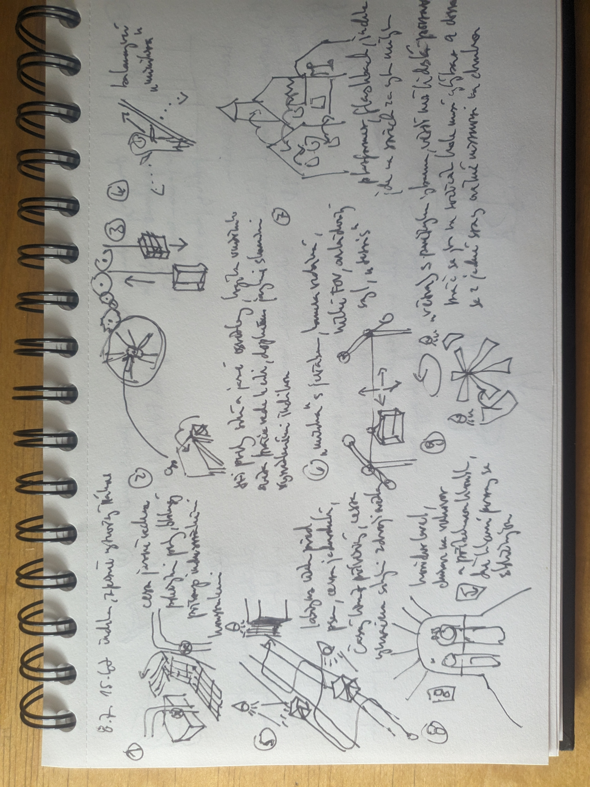
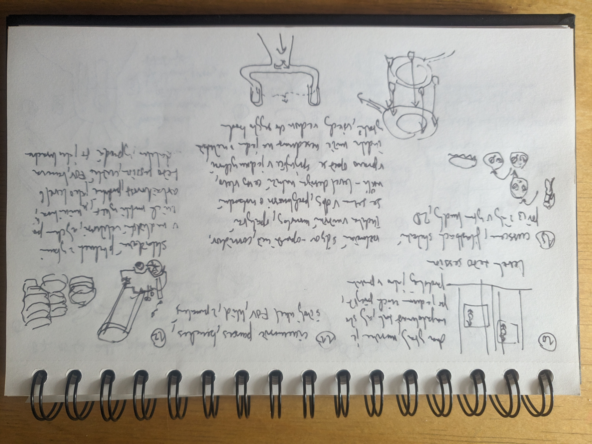

Session 2, picking up exactly where session 1 stopped (the mill). Source: audio
commentary and handwritten sketches.

recording:
https://www.youtube.com/watch?v=Z5FhfXMGJxk

## Sequence

Mill interior → counterweight elevator → balancing plank → dog maze → the crane +
2D puzzles → flashback platformer → arrival at Spasov → fish-tin puzzles → parting
with Ilya → final flashback and the illusory-choice ending.

## From the scribbles

Jachym's two sketch pages are a numbered storyboard of the whole run — one small
panel per beat, each with a Czech caption. Read against the observations below
(panel → matching observation):

**Sheet 1 — mill to flashback**

1. **Boards corridor** — *"cesta jasně vedená"*: the path laid out in wooden boards,
   funnelled by industrial structure. → obs 1
2. **Mill machine** — the big cog drawn with three marked spots; light picks out the
   three things that matter (elevator, raised platform, key-machine). → obs 2
3. **Counterweight elevator** — a car drawn against its weight (up/down arrows); the
   real counterweight *is* the puzzle. → obs 3
4. **Balancing plank** — captioned *"balancování v minihře"*: new left/right balance
   control, and the first death. → obs 4
5. **Dog maze** — light-guided wooden maze, hide at the end, built with few ways to
   fail. → obs 5
6. **Crane + 2D minigame** — a *"minihra"* noted with a **narrower FOV** and a
   different control scheme (*"tetris"*) running while the characters talk. → obs 6
7. **Flashback platformer** — the warm village/church vignette; Indika steps into her
   past. → obs 7
8. **Corridor-for-talk** — an arch framing the two characters: a corridor "level" that
   keeps you inside the conversation. → obs 8
9. **Fan / windmill verticality** — rotating blades used as a vertical climb
   (*"větrný"*). → verticality beat, cf. obs 9

**Sheet 2 — Spasov to the ending**

10. **Twin elevators** — two coupled cars drawn as linked loops: the counterweight idea
    again, across several vertical levels. → obs 10
11. **Benches** — *"cinematic pauses, lavičky"*: sitting **changes the FOV** and slows
    the pace. → obs 11
12. **Fish-tin stacking** — the stacked-tins climb, flagged as running longer than it
    needs. → obs 12
13. **Parting + illusory choice** — the two heads separating, then a room whose several
    paths/doors all funnel to one exit — choice as fate/destiny. → obs 13

What the sketches add beyond the audio: the explicit **FOV shifts** (tighter in the
crane/2D minigame, and again when you sit on a bench), and the **twin elevators drawn
as two coupled counterweights**, which makes the "teach-once, reuse-later" link back to
the mill visually explicit.

<!-- Panel numbering and a few Czech captions are my best read of the handwriting —
Jachym, correct anything I've mis-parsed. -->

## Observations

1. **Corridor by wooden boards.** The first stretch is a plain corridor with invisible
   walls; the path is literally laid out in **wooden boards** and the **industrial
   environment funnels you** — you can only walk the boards. Light does the guiding
   again so you never get lost.
2. **Three lit spots = three tasks.** Inside the giant mill, light marks the **three
   things that matter**: an elevator, a raised platform reachable only via the movable
   tool, and a machine that needs a **non-broken wooden key**. The game's own logic
   ("find an unbroken key") is stated and re-signalled many times. Climb the strongly-lit
   platform → key → machine → the elevator (with Ilya) starts everything moving, and you
   understand the elevator was the last unchecked spot.
3. **Counterweight elevator — realistic logic.** The elevator's real-world counterweight
   *is* the puzzle: he goes down so it lifts Indika up. Same counterweight logic returns
   later — a mechanic the game teaches once and reuses.
4. **Balancing plank — new mechanic, first death.** A narrow plank introduces
   left/right **balancing** control, unannounced. Refreshing that you don't just walk;
   a slow-paced mini-game, and the first time you see **Indika die** — beautifully
   stylised, on-theme, and not actually hard.
5. **Dog maze — the fake slow-down.** A small maze in wooden structures; you run from the
   returning **dog**, guided by light, and hide. The apparent slowing of pace *doesn't*
   work — the dog breaks in, you solve a quick verticality puzzle and escape. Designed so
   there are **very few ways to fail**.
6. **The crane + 2D minigames.** Outdoors, slow free-roam again: read the environment,
   then turn on a **beautiful crane** (Indika loves machines — a running theme).
   Interlaced **simple 2D puzzles** (a primitive Tetris-like stack) play *while the
   characters talk* — reminiscent of *It Takes Two*, keeping a talky beat from going
   monotone. The courtyard here is **exaggeratedly unrealistic** (wagons everywhere).
7. **Flashback = a different game.** The pixel-art retro platformer returns, its
   difficulty ramping section by section, teaching Indika's past. The warm, cute village
   art deliberately **balances** the gritty industrial present — even as its themes stay
   dark.
8. **Spasov arrival — corridor for atmosphere.** Entering the new city drops you into a
   corridor level (like the motorbike stretch last session): it sells atmosphere *and*
   keeps you inside the conversation. Every square metre is filled with believable
   pseudo-18/19th-century Russian detail, often for scenes you pass in seconds.
9. **Faster environmental puzzle — pacing change.** A more dynamic puzzle (reminiscent of
   *What Remains of Edith Finch*'s giant-fish sequence) is still light-guided but **much
   faster** — a deliberate change of pace.
10. **Twin-elevator puzzle (+ an accidental shortcut).** Two elevators balanced across
    three/four vertical levels — the counterweight idea again. Curiosity test: jumping
    down the shaft **didn't** kill Indika or hit an invisible wall; the reload restored
    the elevator where he'd placed it, **skipping the intended backtrack** and making the
    section easier.
11. **Benches = cinematic pauses.** You can sit on benches scattered through the world for
    framed cinematic shots; slowing down to look around **sells the detail** and the
    narrator sometimes describes the place. Pacing tool disguised as an optional verb.
12. **Fish-tin stacking — a puzzle that overstays.** Stacking giant fish tins to climb;
    simple, but it **takes longer than it needs** right before a story beat you're eager
    to reach.
13. **Parting, then the illusory-choice ending.** After the last stretch with Ilya they
    separate. A final Indika flashback platformer leads into the session's key idea: you're
    **given choices — which elevator, which path, which door — that all lead to the same
    end**, mirroring her philosophical talks with Ilya about fate and destiny. Choice as
    theme, expressed through level design.

<strong>▸ Full walkthrough from the recording (structured transcript)</strong>

Jachym's commentary from the session recording, cleaned & structured — detail layer for
the observations above.

**Mill interior (obs. 1–2).** Simple corridor with invisible walls, the player led by a
path of wooden boards; the industrial environment leads and you can't leave the boards.
Light plays the strongest guiding role. A second section of the mill uses light to signify
the three most important spots: an elevator, a vertically elevated platform accessible only
via a movable tool, and a machine you start with a wooden key. The game's logic tells you to
search for a non-broken key and indicates it many times. Climb the strongly-lit platform,
find the unbroken key, return to the machine, start it. The third place is the elevator where
the side character Ilya is — now everything starts moving and you understand the elevator was
the last spot left.

**Counterweight elevator (obs. 3).** Back at the up/down control: realistic game logic — the
elevator with the counterweight means when he goes up/down he can lift Indika on the
counterweight. Go up with Indika; the level ends. The exit automatically follows up after you.

**Balancing plank (obs. 4).** One way forward along a narrow plank. A new mechanic not
introduced before: control left/right to balance the main character. Refreshing not to just
walk — a small mini-game, and interesting to see Indika die for the first time, very
stylishly in the game's theme. Not difficult; slow-paced.

**Dog maze (obs. 5).** A small maze built to fit the environment — wooden structures, mess
lying around. You run because the dog from previous levels is chasing; not many ways to go,
guided by light, hide at the end. The seeming slow-down doesn't work: the dog gets into the
room, you solve a small verticality puzzle and pass. Back in the room you know the layout,
still escaping the dog; the level is designed on purpose so there aren't many ways to fail.
Follow Ilya as the goal, then it's finished. ("It loses its brain with its memories.")

**The crane + 2D puzzles (obs. 6).** After the fast sequence, a slow outdoor sequence — the
game's pattern by now: realistically free-to-roam, read the environment, then the way is shut.
A beautiful crane you turn on (Indika is always eager to use machines — a theme), interlaced
with small 2D puzzles in a funny fashion that entertains and keeps things from feeling
monotone. Reminiscent of *It Takes Two* — a very primitive Tetris puzzle while the two
characters talk. Very simple, even exaggeratedly unrealistic level design: a courtyard filled
with wagons. A longer cutscene progresses the narrative.

**Flashback platformer (obs. 7).** Arriving to pass through the city with Ilya, beautifully
interlaced with the flashback — always a pixelated retro platformer. Very primitive mechanics
but difficulty slowly rising after each section; fun, and you always learn something about
Indika's past and how she got to the monastery. The visual style is beautiful and balances the
gritty industrial rest of the game — a cute, warm, touching environment from her past village,
even though the themes there are very dark.

**Spasov, present day (obs. 8).** Back in Spasov, arriving at the soldier Ilya. Worth
stressing how beautifully and densely the environments are built — often "unnecessarily," since
you spend seconds there, yet every metre is filled with believable pseudo-18/19th-century
Russia. Entering the new city you're literally in a corridor level (like driving the motorbike
last session): it builds atmosphere and lets you follow the characters' conversation.

**Faster puzzle (obs. 9).** A more dynamic environmental puzzle — reminds him of the giant-fish
theme in *What Remains of Edith Finch*. Fun to watch in the cutscene because of Satan/the
demon's commentary. Not difficult, still light-guided, but much faster than before — a great
change of pacing. Then a touching cutscene progresses the narrative (unspoiled), interlaced
with the slow sections that give time to travel with the characters. ("So the monastery wasn't
your choice. It was—")

**Corridor talk + twin elevators (obs. 10).** Another corridor-like level as the characters get
to know each other — now a long philosophical talk. Not many choices where to go, though there
are dead ends you can wander, led by the main character and by light, while they discuss heavy
themes. Then two elevators to balance across three/four vertical levels — similar to the
counterweight before. Out of curiosity he jumped into the shaft to see if Indika would die or hit
an invisible wall; the game allowed it. The intended design was to go back and reposition the
elevator, but the reload just before the section kept the elevator where he'd placed it, so he
skipped the running-around — making the session easier here.

**Benches & detail (obs. 11).** Wanted to show a beautiful visual part: cinematic shots each time
the player sits on the benches scattered around the world. Slowing down to look around sells the
detail and the wonderfully designed world; sometimes the narrator describes what a part of the
world is.

**Fish-tin puzzle (obs. 12).** Another environmental mini-game: stacking giant fish tins to climb
up. Nothing sophisticated, but it takes a longer while than it needed — right before the end of
the narrative section, so he was eager to move on.

**Parting & the ending (obs. 13).** The last section with Ilya; you learn more about him and the
relationship strengthens (unspoiled), after which they're separated. Then another Indika
flashback — a funny platforming part, thematically tied to the flashback and her memories; the
sound design carries you through it (wonderful design). Indika walks alone in a seemingly
corridor level, contemplating, and here's a very interesting theme: you're given choices — which
elevator to take, which path, which door to open — and they all lead to the same end, related to
the philosophical talks with Ilya about fate and destiny. That was the end of this playthrough.

### New threads from the recording (beyond session 1)

- **Illusory choice as level-design language** — choices of path/door/elevator that all
  converge, made to *mean* fate and destiny. Direct evolution of session 1's fake-choice
  fork → strengthens the case for narrative pattern **NP-02 The Fake Choice**, now doing
  thematic work, not just corridor-preservation.
- **Counterweight logic as a taught-then-reused mechanic** — introduced at the mill, reprised
  in the twin-elevator puzzle. A clean example of teach-once, vary-later.
- **Minigames as anti-monotony under dialogue** — 2D Tetris/crane and fish-tin stacking run
  *while characters talk*, keeping talky beats active (cf. *It Takes Two*). Watch the cost:
  the fish-tin one overstayed.
- **Death as style, not punishment** — the plank's first death is on-theme and low-stakes;
  failure is expressive, and levels are built so there are "not many ways to fail."
- **Benches as diegetic pacing** — an optional "sit" verb that buys cinematic slow-downs and
  narration. Candidate reuse: give the player a low-cost way to *choose* to slow down.
- **The accidental shortcut** — a physics/reload interaction let him skip intended backtracking.
  Worth noting as a robustness edge for our own checkpoint design.

## Conclusion

<todo — Jachym: the through-line this session is **choice that doesn't branch** — the plank,
the twin elevators, and especially the final door/path/elevator picks that all converge. Pairs
with session 1's fork. Strong candidate for a dedicated NP-02 write-up or a small prototype:
a room offering three doors that provably lead to one place. Also flag the counterweight as a
reusable "teach-once" mechanic.>

<!-- Session 2 notes updated with scribbles from the session. -->
