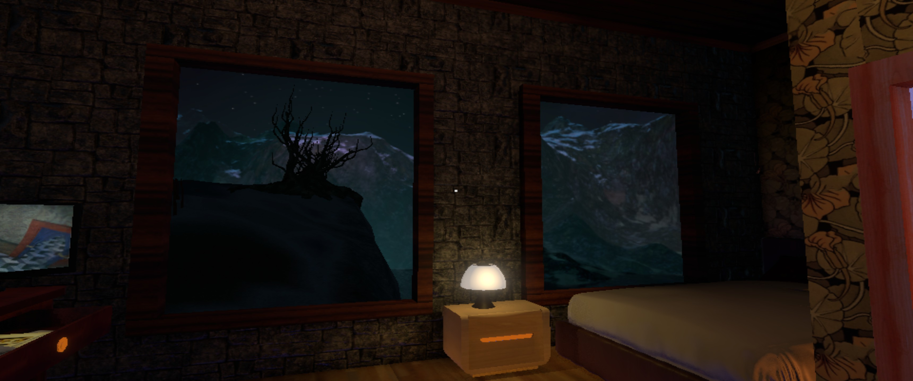
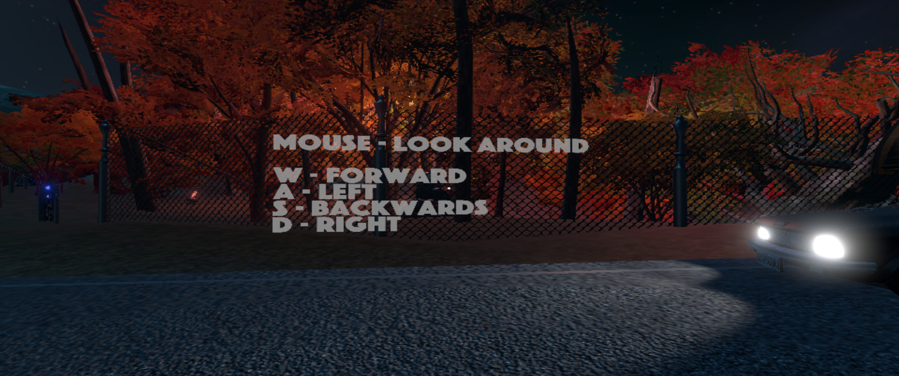
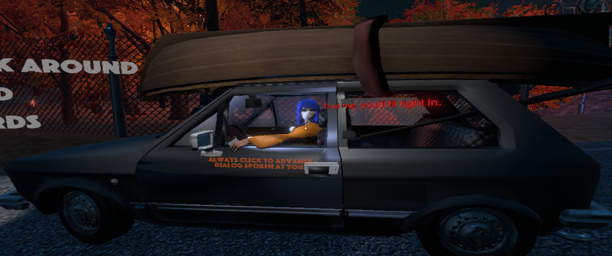
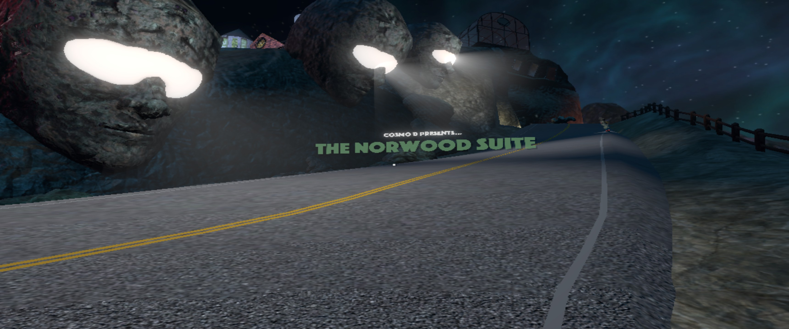
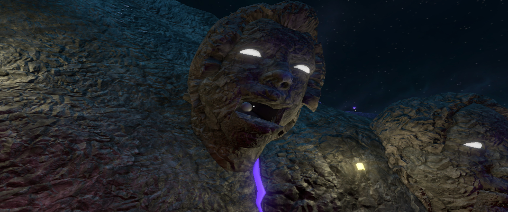
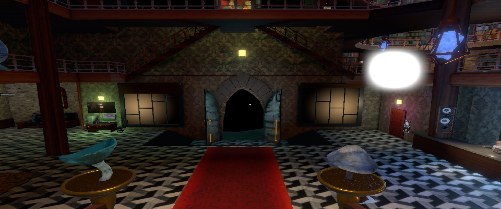
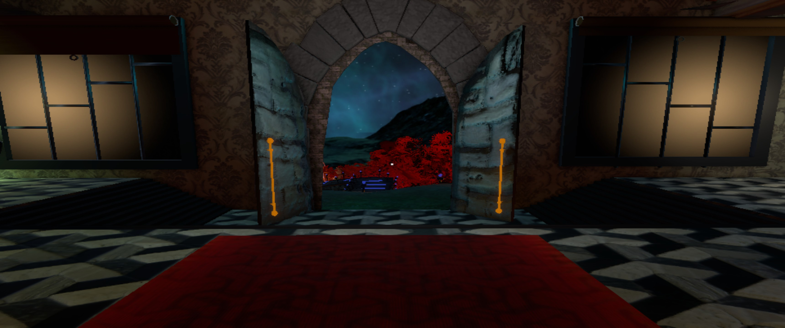
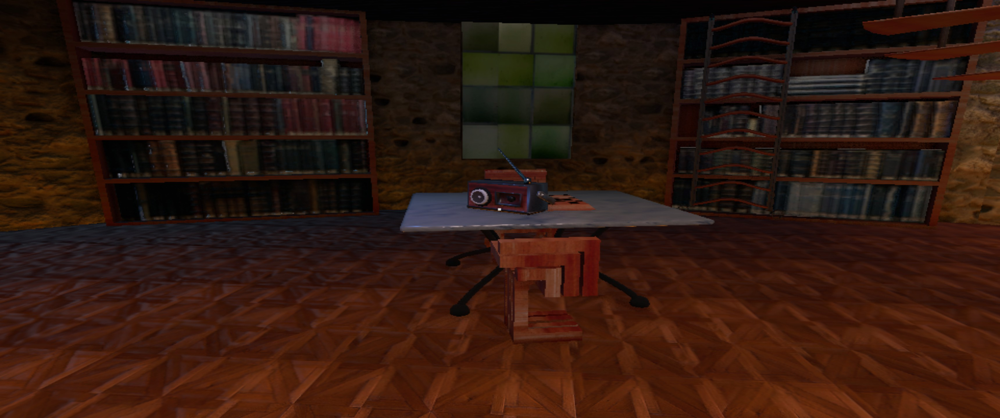

First session, ~40 min — arrival, road to the hotel, reception, room, library.
Source: audio-only voice log, structured from transcript.

## The headline principle

**Every piece of music has a visible, diegetic source — no exceptions found yet.**
Car radio → portable radio in the library → hotel speakers (with pumping animation) →
statue heads that literally open their mouths and add choir voices when you approach,
and go silent when they close. If a track plays, you can find where it's coming from.
The world *is* the sound system.

## Observations

**Opening.** Complete black screen, sound effects only — anticipation before any image.
The game commits to audio-first from second one.

**Diegetic tutorial.** Controls are written *on the environment* — movement keys on a
fence, NPC-interaction rules on the side of a car. No UI overlay teaches you anything.

**Music is spatial and blended by proximity.** Near the car the radio is loud and bouncy;
walk away and it thins into the distance while ambience (wind, shaking autumn leaves,
animals) persists. Street triggers crossfade the next track in ~100m apart, with
ambience-only gaps between. Walking back re-triggers the previous track — verified by test.

**Dialogue is an instrument.** Dialogue lines don't sit under the music — they *play
in it*, rhythmically, as if each spoken line were a musical voice rolled into the
running track (one NPC gets a robot-pitched voice that fades into the mix). Never seen —
heard — before. Presentation supports it: text appears at eye level (not bottom-screen),
backlit so it pops, speakers distinguished by color.

**Total feedback.** Every action — picking up, opening, pushing — has a dedicated sound.
No silent interaction found.

**Set-piece arrival.** Three giant heads switch on their eye-lights with a sound cue and
the title credits appear *on the road* — the world presents the game.

**Entrance reveal.** From afar the open hotel doors are pure black; approach and the
interior suddenly resolves — a doorway-sized delayed reveal (PP-11/PP-12 territory).

**Windows as compositions.** Inside/outside views are consistently staged — interior
light against the night landscape. Works everywhere.

**Quests without a log.** Tasks emerge purely from conversation and found objects (a note
on the hotel room desk) — no quest log, nothing is recorded or re-readable. Friction noted:
after 2–3 side hints I already feel the pull to take real-world notes, and re-asking NPCs
is the only recovery. NPCs do signal when they've "said everything for now" — a soft
end-of-content marker.

**Anonymous protagonist.** First person, zero information about who I am — just "a guest."
And it doesn't seem to matter. Identity withheld without cost (so far).

**Craft details.** Chandeliers swing slightly, damp/smoke drifts in the light — the still
world keeps moving.

## How can I reuse it?

- The visible-source rule is a *complete* sound-design stance, not a trick — candidate
  for a new pattern (**SP-06 Visible Source?**) once it shows up in a second game.
- Diegetic tutorials (GP-05 run in production): the environment can carry all onboarding.
- For our own game: ultra-wide support mattered a lot here (fully surrounded by the scene) —
  worth budgeting from the start.
- Open design question from the friction: is "no quest log" a cost worth paying for
  immersion — or would a diegetic notebook (in-world object) keep both?

## Next session

Buy the soundtrack. Dig into *how* the adaptive layering is built — listen for stem
counts and transition rules; check if the dialogue-instrument holds for every NPC.
