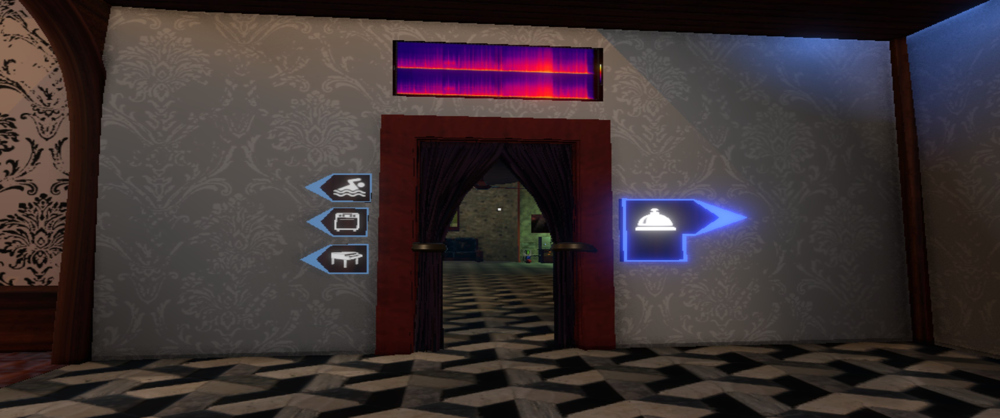
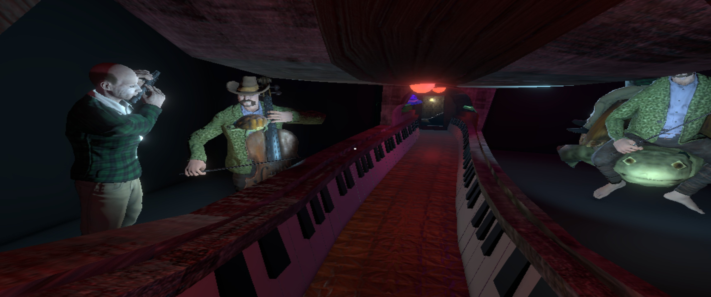
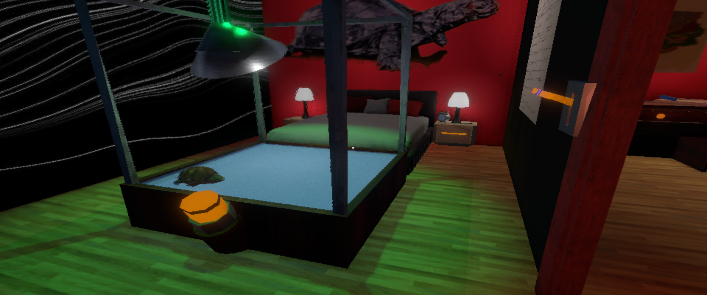
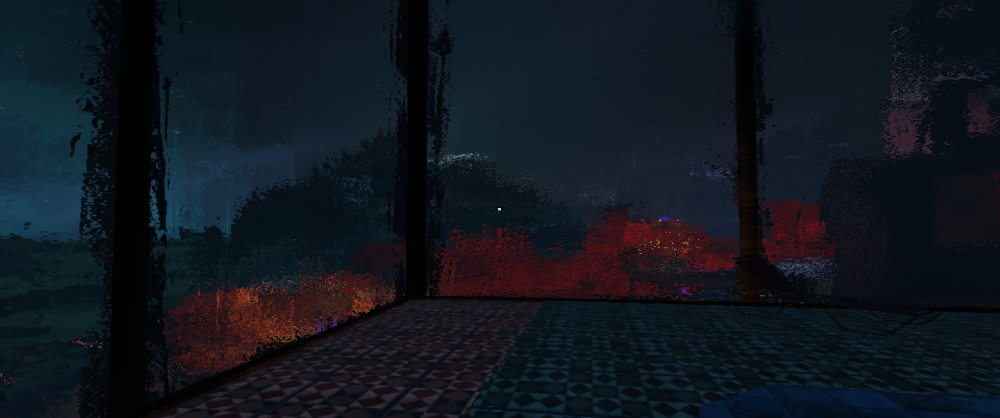
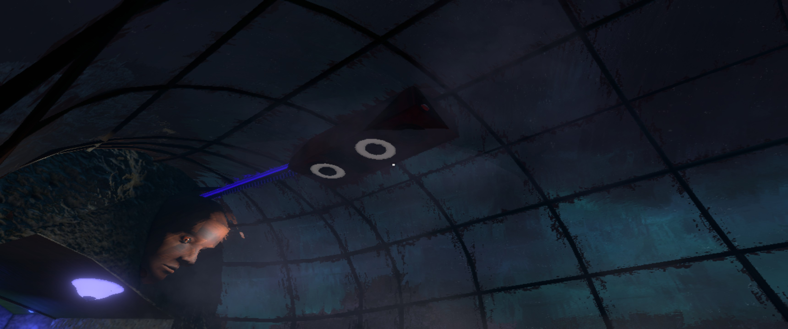
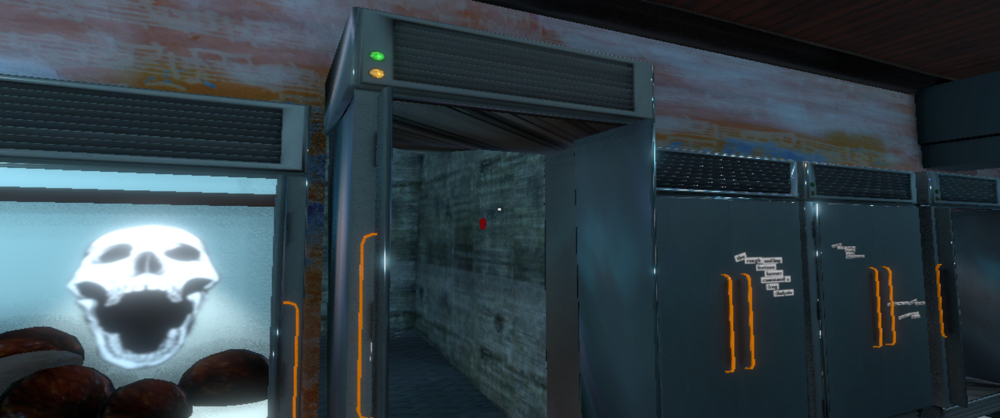
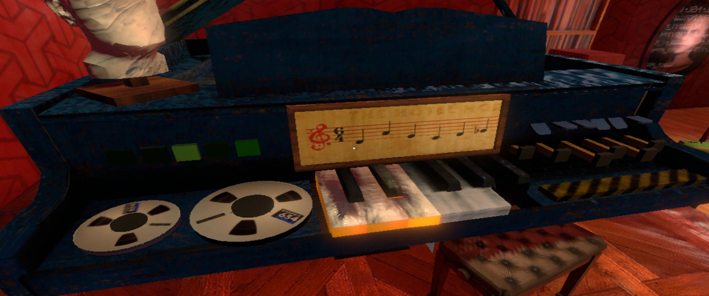
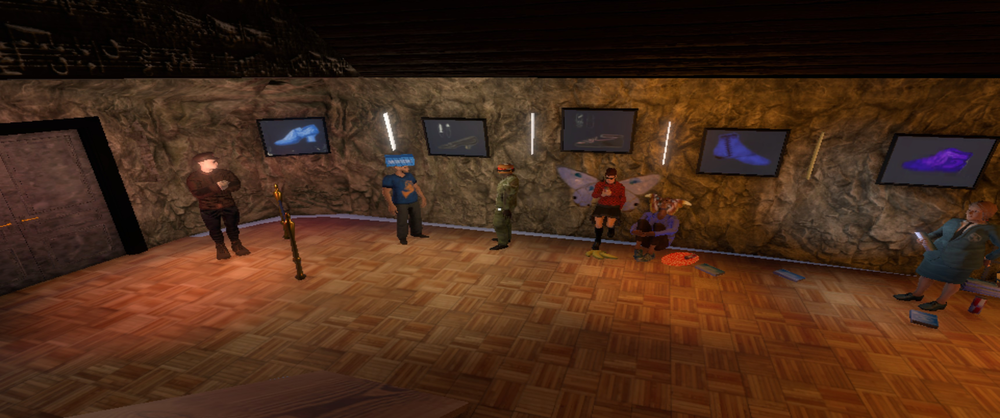

Second session, ~30 min — hunting for the basement. Slower than session 1: I know *what*
to do (get to the party) but spend the whole time working out *where* and *how*. Which
turned out to be the interesting part.
Source: audio-only voice log, structured from transcript (full log at the bottom).

## The headline principle

**It's one continuous, interconnected building — no levels, no chapters, no map — so the
architecture *is* the navigation.** You don't read a level; you learn a hotel. Floors
cross-connect the way a real building does (a route that dead-ends on 1 opens from 2),
and the only "map" is diegetic signage baked into the walls. Getting un-lost means
reading the space, not a UI.

## Observations

**Wayfinding without a map.** No minimap, no quest markers. Direction comes from
icon-signs mounted in the world (pool, kitchen, piano-lounge, reception) — exactly the
signage a real hotel has, so it reads as furniture, not UI (PP-05 navigation-by-landmarks).
It works, but it's coarse: nothing points to "basement," so once the goal isn't a signed
amenity, the signs stop helping.

**The concierge is the map's index.** When genuinely stuck, the move is always "go talk to
the concierge" — one central NPC who re-orients you (PP-09 npc-as-navigation). The whole
navigation system leans on him as the fallback when the environment runs out of signs.

**Secret buttons → surrealist in-between → shortcut.** Scattered hidden buttons open secret
doors, and they *always* dump you into the same surreal, non-hotel "in-between" space —
Alice-through-the-passage. At first it feels like flavour / dead-ends, then one of them
turns out to be a **shortcut** back into the hotel. So the surreal spaces aren't just set
dressing; they're the connective tissue that folds the map (PP-24 curiosity-chain).

**Rooms keep giving.** Almost every new room has its own diegetic track playing off a
visible source, and there are *far* more rooms than the critical path needs. The pull to
explore constantly competes with the actual quest — hard to hunt for one thing when six
unseen doors are in view. (Reference point I kept thinking of: *Abiotic Factor*'s
interconnected sprawl; also the hotel-in-Fallout-New-Vegas / *Shining* register.)

**The pool — sound-source rule still holds.** Windowed on all sides, blurred glass, exterior
lights bleeding through — a strong window-composition again. And the speaker is *on the
ceiling* of the glass dome, still a visible diegetic source (carries session 1's
"every track has a source" straight into a new room).

**Two affordance signals, both non-verbal.**
1. *Orange = interactable.* Handles, buttons, drawers glow orange — the RE-style "this cover
   colour means you can touch it." Once you read it, the whole hotel becomes legible at a glance.
2. *Particle "eyes" = hidden item.* When an item sits out of sight (behind a door), a little
   cluster of eye/particle motes leaks through to flag it. Clever, but I'm not sure I like it —
   it slightly undercuts the "find it yourself" honesty of the rest of the world.

**Trigger-on-collection re-scenes the world.** Finishing one quest visibly rearranged a space
on return: NPCs gone, a bus now parked that wasn't there before. State changes are staged
through the environment, not a cutscene (PP-25 return-visit — the same room rewards a second look).

**The party gate: costume + melody.** First real hard gate. A bouncer blocks the basement
club until I'm fully costumed (have the beard and jacket, still missing shoes), *and* I have
to complete a musical riddle — collect the scattered piano keys and play the exact melody
written on the score. A very legible, very on-theme lock: the hotel makes you *perform music*
to get into the music.

**The costume itself is a checklist gate.** Beard ✓, jacket ✓, shoes ✗ — assembled from
found items across the building. Common quest motive, but here the "shoe gallery" makes the
requirement diegetic rather than a UI checklist.

## Friction (carried over + new)

**When is a dialogue *over*?** Recurring problem, worse this session. The quest-relevant beat
(getting handed the item) often lands in the *middle* of a conversation, then the NPC keeps
talking — so I can't tell whether the rest matters or I'm free to leave. It nudges you to
keep clicking, which is partly the point, but it muddies the "I'm done here, move on" signal.
*Design fix I'd try: put the quest-critical payload at the **end** of the dialogue, so the
hand-off doubles as the "you're clear to go" marker.* (Related to session 1's no-quest-log
friction — both are about the game withholding "task state.")

**First time I felt lost on progression.** Not lost in space — lost in *what unlocks what*.
Signs point to rooms, not to the basement goal, so the middle of the session sagged. The game
has no chapters/levels to reassure you you're "making progress," which mostly works but leaves
a soft spot exactly at the first big gate.

**Input overload.** Left-click does everything — pull, push, shove-aside, talk — *and* you
steer the camera with the same mouse. Actions and looking occasionally collide. Standard
first-person-walker tax, but noticeable.

## How can I reuse it?

- **Diegetic wayfinding as a system, not a prop:** hotel-style signage can replace a minimap
  *if* every goal maps to a signed destination. The gap here (nothing signs the basement) is
  the lesson — decide up front which goals get world-signage and which lean on an NPC index.
- **Surreal shortcuts:** secret passages that read as flavour but quietly fold the map are a
  cheap way to reward curiosity twice (mystery *and* a real traversal shortcut). Candidate
  pattern pairing with PP-24.
- **Perform-the-theme gates:** the "play the melody to enter the music room" lock is a great
  template — make the key *be* the game's core material, not an abstract keycard.
- **For our own game:** steal the orange-affordance legibility, but treat the particle
  "hidden-item eyes" as optional/assist rather than default — it trades discovery for convenience.
- **Open question:** does "no chapters, one continuous space" need *some* progression
  reassurance at hard gates, or is the disorientation part of the deal?

## Next session

Find the shoes, finish the melody, get into the basement party — see what the club payoff
actually is and whether the surreal in-between spaces resolve into anything. Watch whether the
dialogue-ending friction ever gets a diegetic fix, and start logging which secret passages are
pure flavour vs. real shortcuts (candidate for a small map-folding note).

<strong>▸ Full voice-log transcript (session 2)</strong>

This is the recording of the 2nd play session of The Norwood Suite. It's July 7th, ~30 min.

I have a bit of difficulty with the dialogues — you don't understand when they really end. It
motivates you to click more and more, but a lot of the time the quest part is already done (I've
been handed the item), yet the dialogue keeps going and I don't know if it's important. It's a joy
to read, but in my opinion the quest-relevant stuff should be handed at the *end* of the dialogue so
I know I can move on.

This session I'm trying to find my way to the basement — I've been pointed there but have no idea how
to reach it. Wandering, aimlessly discovering rooms I hadn't seen. There are signs — icons for the
different rooms. That's all you get in terms of a map; there's no map, but the signs work like a real
hotel, so it's diegetic. I like it. Everything is baked into the world, which fits the hotel.

Looking for the pool now, because in the pool locker there's something. Hard not to get distracted
while looking for one thing — so many rooms I haven't seen. Sometimes when an item isn't visible
because it's behind a door, I see a visual sign that there might be an item: little eye/particle
effects (Unity particle system) telling me there's an item inside. Interesting — don't know if I like
it. The rooms just keep giving — another room, another track. It's not every room, but the sound
system provides the soundtrack and it's consistently good.

Found the locker room I have a key for (52), got the item. Not so relevant for the Atlas, just me
progressing. Arrived at the pool — it also has the warmth particle effect. Can't access the water,
blocked by invisible collision. The pool is full of windows, blurry (because it's a pool), and you
can see the lights from outside — very nice visual effect. And there's sound playing here too; this
time the subwoofer/sound box is at the *ceiling* of this windowed dome. Visually amazing. Music
amazing as always.

Usually I'm not big on first-person weird-exploration games, but playing this on ultrawide is so
different in terms of immersion. Also nice: the interconnectivity of the map — as a hotel, there's so
much interconnection, stuff that connects on level 2 that doesn't on level 1. Reminds me a lot of
Abiotic Factor, which I recently played. The number of tracks is crazy. I like the secret doors —
sometimes you find a button and it opens a secret puzzle. Alice in Wonderland is what I connect to
this, especially the secret door that takes you from the normal hotel into a surrealist passage.

Solved one of the quests, and this triggered the NPCs not being there anymore — collection triggers a
rearrangement of the scene. I returned and there's now a bus that wasn't here before, and 2 NPCs
missing. Trigger on collection.

First time I feel lost on progression. I have to go to the basement. I think I already have to cook
stuff / check boxes for the entry, but I don't know where to go. From a design perspective I should
consider the signs, but nothing points to "basement." The central "I don't know what to do" move in
this game is talking to the concierge — he's the central NPC. Found a way down: there's a queue for
the party, a real club scene. Blocked by the bouncer — I need to be fully costumed. I have a beard and
a jacket, but I'm missing stuff, probably shoes. Quest is clear: get the stuff, access the basement.
And I need to find all the piano keys to play a certain melody. One's missing.

So far this game has no chapters/levels — it's all one thing. I have no strong opinion on that. I
think I've seen most of the rooms — no, wrong, just saw another way. Some environments remind me of
that hotel place in Fallout: New Vegas, probably also The Shining. Controls sometimes feel a bit
lonely: everything works with mouse-click (pull, push, push aside) and you also use the mouse to look
around, so sometimes it gets mixed up — the low-poly first-person tax. Orange/yellow like Resident
Evil: the cover colour indicates you can interact/collect. Here orange = handles, buttons, etc.

Progress feels a bit slower than session 1, because I'm at the first major gate: access to the party.
Common quest motive. Still fun because the vibes are on. Found another secret passage from a button —
the secret passages always lead to the surrealist in-between place, connected somehow but I don't
understand how. A dead end. Then: oh — the surreal space also gives you shortcuts. Came out at the
fridge. Got busy trying to make a sandwich; found a cutting machine in the kitchen, could cut a lot of
stuff, but the bread doesn't cut (need a knife?). Not relevant for the Atlas — I'm still low on what I
need for the party. Two things I'm looking for: clothes and the piano-roll keys. Found the key. There's
a musical riddle — notes, and with the missing keys I need to play exactly the melody on the sheet. I'll
photograph it. Still think I'm missing one key.

Playtime coming to an end (half an hour). Summary: still very much like the game. Today's progress felt
slower — I know what to do but I'm still missing pieces. Very motivated to keep playing; sure there are
more surprises. Nothing I particularly dislike. I do think it's *not* for a mainstream audience — not
enough "game" to attract gamer-gamers; it leans experimental, and if you're into that, it's great. Right
now I'm a bit stuck. One last round: went back to the one hotel room I had access to, the last image
that probably hides a button — yes, found the last piano key. Now I can play the melody. Reward system
works. I know my quest: collect the balls to progress and get access to the club. Collected all of them.
The reward loop is clear and it works. Good session — I'd have wished for a bit more progress in the time,
but still looking forward to uncovering more secrets next session.

